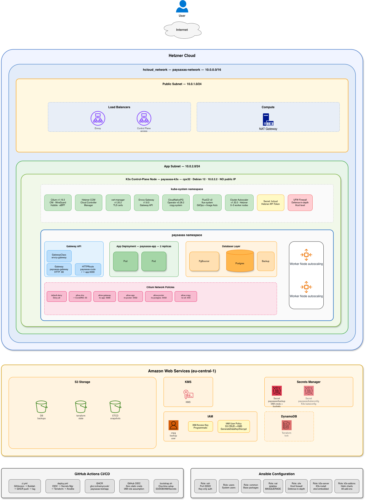
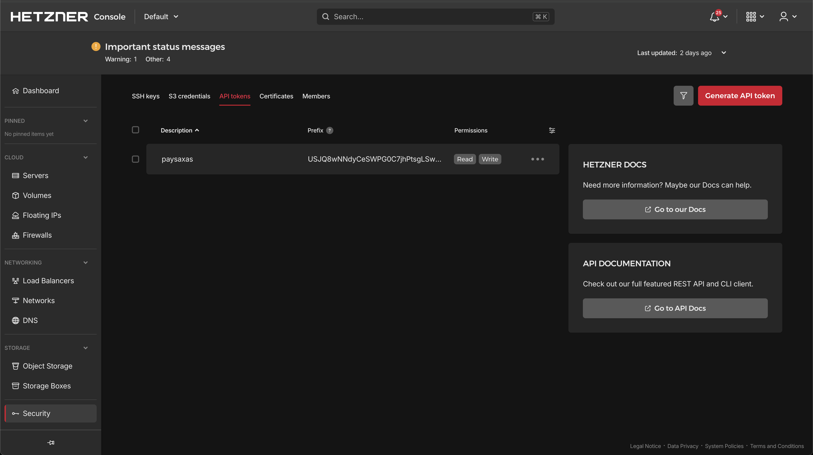
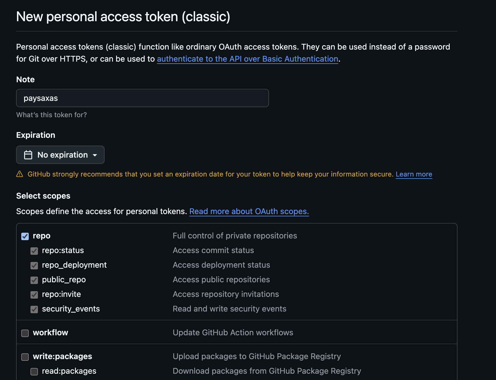
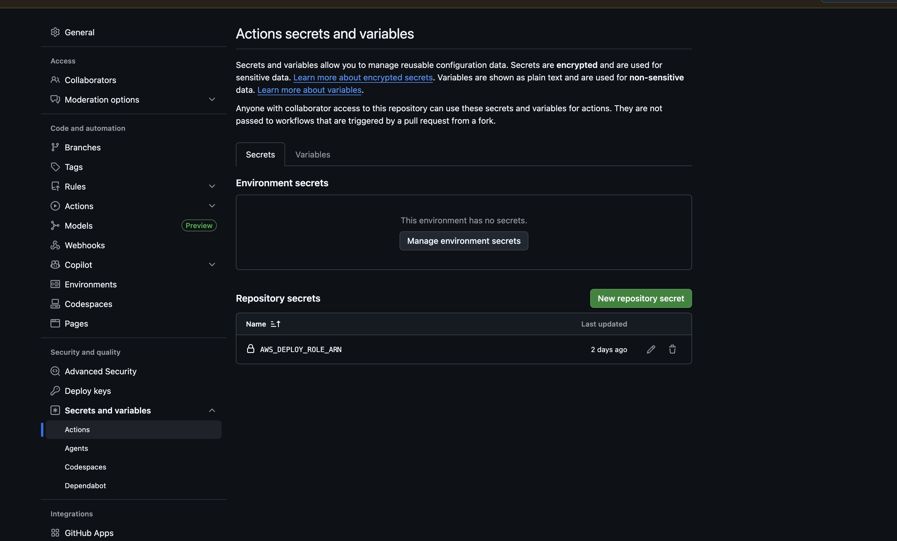

# PaySaxas DevOps Test Assignment



[Source (draw.io)](https://drive.google.com/file/d/1y9o9V7z7Dp4jGZNiilQpbyGc_OpS0OT-/view?usp=sharing)

# Setup from scratch

## Prerequisites

You need these tools installed locally:

- **AWS CLI v2** — `brew install awscli` or [aws.amazon.com/cli](https://aws.amazon.com/cli/)
- **Terraform** >= 1.10 — `brew install terraform`
- **Ansible** core >= 2.17 — `brew install ansible` or `pip install ansible-core`
- **kubectl** — `brew install kubectl`
- **jq** — `brew install jq`

You also need:

- An **AWS account** with IAM user or SSO profile configured in aws-vault
- A **Hetzner Cloud** account with an API token (Console → Security → API Tokens → Generate API token with Read & Write permissions)



- A **GitHub** account (the repo must be pushed to GitHub for CI/CD and FluxCD)
- A **GitHub Personal Access Token** with `repo` scope (Settings → Developer Settings → Tokens → Generate) — for FluxCD image automation

## Step 1: Clone and configure

```bash
git clone https://github.com/inemyrovsk/paysaxas-test.git
cd paysaxas-test
```

## Step 2: Run bootstrap

The bootstrap script creates all AWS prerequisites and generates an SSH key pair. It's fully idempotent — safe to run multiple times.

```bash
export HCLOUD_TOKEN="your-hetzner-cloud-api-token"
./scripts/bootstrap.sh
```

This creates:

- S3 bucket for Terraform state (versioned, KMS-encrypted)
- DynamoDB table for state locking
- SSH key pair stored in AWS Secrets Manager (`paysaxas/infrastructure`)
- GitHub OIDC provider + IAM role for CI/CD
- `terraform/backend.hcl` for local Terraform init

At the end it prints the IAM role ARN. The `paysaxas/infrastructure` secret in AWS Secrets Manager should contain these keys:


## Step 3: Add GitHub token to Secrets Manager

FluxCD needs a GitHub Personal Access Token to auto-commit image tag updates.

1. Go to [github.com/settings/tokens/new](https://github.com/settings/tokens/new)
2. Set note to `paysaxas`, expiration as needed
3. Select the **`repo`** scope (full control of private repositories)



4. Click **Generate token** and copy the value
5. Add it to AWS Secrets Manager:

```bash
bash -c '
  SECRET=$(aws secretsmanager get-secret-value --secret-id paysaxas/infrastructure --query SecretString --output text)
  NEW=$(echo "$SECRET" | jq --arg token "ghp_YOUR_GITHUB_PAT" ".github_token = \$token")
  aws secretsmanager put-secret-value --secret-id paysaxas/infrastructure --secret-string "$NEW"
'
```

## Step 4: Set GitHub Actions secret

Go to your GitHub repo → Settings → Secrets and variables → Actions → New repository secret:

- Name: `AWS_DEPLOY_ROLE_ARN`
- Value: the ARN printed at the end of bootstrap (e.g. `arn:aws:iam::123456789:role/paysaxas-github-deploy`)



## Step 5: Deploy

Push to main — the deploy workflow runs automatically:

1. Terraform provisions Hetzner servers, network, LB, and AWS resources (S3, KMS, IAM)
2. Ansible configures K3s, Cilium, Envoy Gateway, CNPG, FluxCD, backups, autoscaler

## Step 6: Verify

```bash
# App should respond via ingress LB
curl http://<INGRESS_LB_IP>/
# → "App is running"

# Create and list items
curl -X POST http://<INGRESS_LB_IP>/items -H "Content-Type: application/json" -d '{"name":"hello"}'
curl http://<INGRESS_LB_IP>/items
```

## Tear down

```bash
terraform -chdir=terraform destroy
```

Note: the hcloud-ccm-managed ingress LB is created by Kubernetes, not Terraform. Delete it manually from Hetzner Console if it persists after destroy.

---

## Workload split

I put all compute on a single Hetzner server and used AWS only for managed services. The reason is simple - Hetzner is 3-5x cheaper for compute (~€8/mo vs ~$280/mo on pure AWS for comparable specs), and cross-cloud DB latency would be terrible if I split the DB to AWS. AWS is used for what it does best: S3 for backups with Object Lock, KMS for encryption, IAM for zero-credential CI/CD.

Both sides are in EU (Hetzner Nuremberg + AWS Frankfurt).

# Kubernetes

## K3s

I went with K3s because it's a CNCF-certified Kubernetes distribution with ~512MB RAM overhead. The Ansible role to install it is about 60 lines compared to ~250 for kubeadm. K3s is configured with `cluster-init: true` which enables embedded etcd (same as kube-hetzner) for native etcd snapshot support.

### Alternatives considered

- **kubeadm** — too much boilerplate for this scope. Separate containerd, CNI, kube-proxy installation for no real benefit
- **kubespray** — ~15,000 lines of community Ansible code. I want the evaluator to see MY code, not a wrapper around someone else's
- **kube-hetzner module** — uses null_resource + remote-exec (anti-pattern per assignment), requires Packer + MicroOS. Black box
- **kops** — doesn't support Hetzner

# CNI

## Cilium

Cilium was an easy choice. K3s ships with Flannel by default, but Flannel has zero NetworkPolicy support - unacceptable for a fintech company. Cilium gives me eBPF networking (replaces kube-proxy), native NetworkPolicy enforcement at L3/L4/L7, transparent WireGuard pod-to-pod encryption, and Hubble for observability. All in one component.

### Alternatives considered

- **Flannel** — no NetworkPolicy support at all. Would need a separate policy controller
- **Calico** — mature and solid, but iptables-based. Cilium's eBPF approach is more efficient and provides more features in a single component

# Ingress

## Envoy Gateway

I'm using Envoy Gateway as the Gateway API implementation. It's the reference implementation for Kubernetes Gateway API, runs independently of the CNI, and uses Envoy Proxy under the hood which is battle-tested at massive scale.

The ingress load balancer is managed by hcloud-cloud-controller-manager - when Envoy Gateway creates a LoadBalancer Service, hcloud-ccm automatically provisions a Hetzner LB for it. This is separate from the control plane LB.

### Alternatives considered

- **Cilium Gateway API** — tried it first, but it doesn't work with K8s 1.36. The GatewayClass stays in Unknown state
- **Traefik** — bundled with K3s, but I disabled it in favor of Envoy Gateway for proper Gateway API support
- **nginx Ingress** — legacy Ingress API, Gateway API is the future standard

# Database

## CloudNativePG

PostgreSQL 16 managed by CloudNativePG operator. It gives me declarative backup/recovery, built-in PgBouncer pooler in transaction mode, automatic TLS between all components, and WAL archiving to S3 — all as Kubernetes CRDs.

The app connects through the PgBouncer pooler (not directly to PostgreSQL) using individual env vars (POSTGRES_HOST, POSTGRES_USER, etc.) from the CNPG auto-generated secret.

### Alternatives considered

- **Separate VM with PostgreSQL** — more operational overhead, would need a dedicated Ansible role for what CNPG does declaratively
- **AWS RDS** — expensive, and cross-cloud latency from Hetzner to AWS for every DB query would kill performance
- **Self-managed PostgreSQL in K8s** — CNPG is specifically designed for this and handles all the hard parts

### Tradeoff

DB lifecycle is tied to K8s. If K3s goes down, so does the DB. For a production system with strict DB independence SLA, I'd use a separate VM or RDS. For this test assignment, the simplification is worth it.

# OS

## Debian 12

Debian 12 is a minimal, well-tested base for K3s on Hetzner Cloud. Hetzner's cloud networking (private networks, DHCP, systemd-networkd) works seamlessly with Debian out of the box, and the image is lightweight with no unnecessary services.

### Alternatives considered

- **openSUSE Leap 16** — SUSE makes K3s so it's a natural fit. However, openSUSE's default firewalld configuration requires additional tuning for Hetzner private-only servers (no public IP). Debian's simpler networking stack reduced time to production
- **Ubuntu 24.04** — fully viable, but comes with snap and more pre-installed services. Debian gives the same Debian-family compatibility with a leaner base
- **Rocky/Alma 9** — strong choice for RHEL shops, but SELinux + firewalld interactions with K3s add complexity that doesn't pay off for a single-node deployment

# Networking

## 3-subnet architecture

I split the Hetzner private network into three subnets:


| Subnet | CIDR        | Purpose                                             |
| ------ | ----------- | --------------------------------------------------- |
| Public | 10.0.1.0/24 | NAT gateway — egress for private servers            |
| App    | 10.0.2.0/24 | K3s server, app workloads (no public IP)            |
| DB     | 10.0.3.0/24 | Database isolation — network boundary for CNPG pods |


The K3s server has no public IP. All internet access goes through the NAT gateway via iptables MASQUERADE. The Hetzner network route `0.0.0.0/0 → 10.0.1.2` handles egress at the platform level. The default route on the K3s server is set via cloud-init (`bootcmd` + systemd-networkd) to go through the Hetzner virtual gateway `10.0.0.1`.

SSH access to the K3s server is via ProxyCommand through the NAT gateway on port 22022. The port is changed from 22 via cloud-init before the first boot.

## Load balancers

Two separate LBs, each with a single responsibility:

1. **Control Plane LB** (Terraform-managed) — port 6443 only, targets K3s API server, TCP health check
2. **Ingress LB** (hcloud-ccm-managed) — ports 80/443, created automatically when Envoy Gateway deploys a LoadBalancer Service, annotated with Hetzner LB configuration

This separation means I can restrict API access independently from app traffic.

# GitOps

## FluxCD

Application deployment is managed by FluxCD. Flux watches the Git repository and automatically reconciles K8s state when manifests in `k8s/` change.

- **source-controller** — syncs the Git repository
- **kustomize-controller** — applies Kustomize overlays from `k8s/`
- **image-reflector-controller** — watches GHCR for new app image tags
- **image-automation-controller** — auto-commits image tag updates to Git

When CI pushes a new image to GHCR, Flux detects the new semver tag, updates `k8s/app.yml` with the new image reference, commits it, and the kustomize-controller applies the change.

# Security

## Encryption


| Layer              | What                   | How                                        |
| ------------------ | ---------------------- | ------------------------------------------ |
| Pod-to-pod         | All cluster traffic    | Cilium WireGuard                           |
| App → DB           | PostgreSQL connections | CNPG hostssl + SCRAM-SHA-256               |
| Secrets at rest    | K8s Secrets in etcd    | K3s --secrets-encryption (AES-CBC)         |
| Backups in transit | S3 uploads             | Bucket policy denies non-TLS               |
| Backups at rest    | S3 objects             | SSE-KMS with customer-managed key          |
| SSH                | All management         | ED25519 keys, port 22022, no password auth |


## Network security (4 layers)

1. **Hetzner Cloud Firewall** — hypervisor-level, port 22022 on NAT server
2. **UFW** — host-level defense in depth on K3s server
3. **CiliumNetworkPolicies** — pod-level, default deny with explicit allow rules for app→pooler→db, DNS, and S3 egress
4. **WireGuard** — all pod-to-pod traffic encrypted transparently

## Zero static credentials

The CI/CD pipeline uses GitHub OIDC federation to assume an AWS IAM role. SSH keys, HCLOUD_TOKEN, and backup IAM credentials are stored in AWS Secrets Manager and fetched at deploy time. Backup credentials are created by Terraform (IAM user + access key) and stored in a separate Secrets Manager secret.

# Backups

## PostgreSQL (CloudNativePG)

- **Continuous WAL archiving** to S3 via barman (RPO < 5 minutes)
- **Daily base backups** at 03:00 UTC via ScheduledBackup CRD
- **Retention** — 30 days managed by CNPG
- **S3 lifecycle** — Standard → Standard-IA (30d) → Glacier (90d)
- **Object Lock** — Governance mode, 30-day WORM protection

## K3s etcd snapshots

- **Schedule** — every 6 hours to S3 (separate bucket without Object Lock, K3s S3 client doesn't support Content-MD5 required by Object Lock)
- **Retention** — 5 snapshots
- **Compression** — enabled
- **Embedded etcd** — K3s runs with `cluster-init: true` for native etcd snapshot support

## S3 bucket security

- Versioning enabled
- SSE-KMS with customer-managed key (DB backups bucket)
- Public access fully blocked on all buckets
- Bucket policy denies non-TLS requests (DB backups bucket)

# CI/CD

## CI Pipeline (ci.yml)

Triggered on push to main:

1. **Version** — GitVersion generates semantic version
2. **Build** — Buildah builds app image, pushes to GHCR
3. **Release** — Tags the commit with the version

## Deploy Pipeline (deploy.yml)

Triggered on push to main (terraform/ansible/k8s changes) or manual dispatch:

1. **Terraform** — OIDC → assume AWS role → fetch secrets from Secrets Manager → init → plan → apply
2. **Ansible** — SSH to NAT (port 22022) → ProxyCommand to K3s → configure K3s, Cilium, hcloud-ccm, Envoy Gateway, cert-manager, CNPG, FluxCD, Cluster Autoscaler, backups

Backup credentials are stored in Secrets Manager by Terraform and read by the Ansible job directly — no sensitive values passed between CI jobs.

## Bootstrap (one-time)

The `scripts/bootstrap.sh` creates all prerequisites:

- S3 bucket + DynamoDB table for Terraform state
- AWS Secrets Manager secret with SSH keys + HCLOUD_TOKEN
- GitHub OIDC provider + IAM role with full S3, KMS, Secrets Manager, IAM permissions
- Generates `backend.hcl` for local Terraform use

# Autoscaling

## Cluster Autoscaler

Using the official Kubernetes Cluster Autoscaler with Hetzner cloud provider. It can scale from 0 to 3 worker nodes based on pod scheduling pressure. Workers auto-join the K3s cluster via cloud-init with the node token.

Karpenter was my first choice but it doesn't support Hetzner Cloud — it only has a first-class AWS provider.

# Cost estimate


| Component                    | Spec              | Monthly        |
| ---------------------------- | ----------------- | -------------- |
| Hetzner CPX32                | 4 vCPU, 8 GB RAM  | €6.49          |
| Hetzner CX23 (NAT)           | 2 vCPU, 4 GB RAM  | €3.99          |
| Hetzner LB (Control Plane)   | LB11              | €5.39          |
| Hetzner LB (Ingress via CCM) | LB11              | €5.39          |
| AWS S3 backups               | ~5 GB + lifecycle | ~$0.20         |
| AWS S3 etcd snapshots        | ~100 MB           | ~$0.01         |
| AWS KMS                      | 1 CMK             | ~$1            |
| AWS Secrets Manager          | 3 secrets         | ~$1.20         |
| **Total**                    |                   | **~€25 / $27** |


# What I intentionally did not do

- **Multi-node K3s HA** — single control plane is fine for this test. Production: 3 masters with embedded etcd (already enabled via `cluster-init`)
- **TLS on ingress** — cert-manager is installed and ready, just needs a domain + ClusterIssuer
- **Monitoring** — out of scope. CNPG exposes /metrics, Cilium has Hubble CLI. Production: kube-prometheus-stack
- **Service mesh** — Cilium provides encryption + observability without mesh overhead
- **Dynamic secrets (Vault)** — IAM access keys for backups. Vault would be a production upgrade for rotation
- **Restrict SSH to admin IP** — currently open (GitHub Actions has dynamic IPs). Production: VPN or IP allowlist

